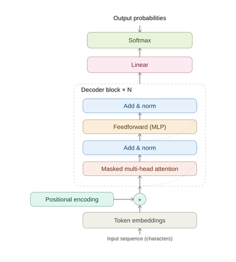
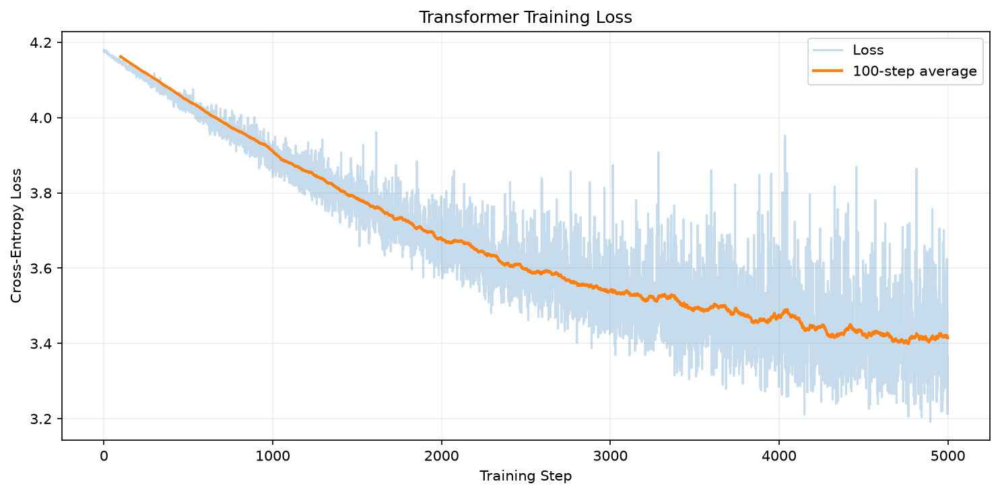

# Transformer From Scratch


A decoder-only (GPT-style) transformer, implemented entirely from scratch in **NumPy** (no PyTorch, no TensorFlow). Every module, from tokenization to backpropagation, is hand-written to understand exactly how a transformer works internally, not just how to call one.

Trained on the [tiny Shakespeare](https://github.com/karpathy/char-rnn) dataset to do character-level next-token prediction.

## Architecture



This is a **decoder-only** transformer (like GPT), not the original encoder-decoder design from "Attention Is All You Need." That means no encoder stack and no cross-attention, only masked self-attention, since the model only needs to predict the next token from what came before it.

**Data flow:**

```
text → tokenizer → embedding + positional encoding
     → [transformer block × N] → output head → next-character probabilities
```

Each transformer block (pre-norm design):

```
x = x + Attention(LayerNorm(x))
x = x + FeedForward(LayerNorm(x))
```

Every module (tokenizer, embedding, positional encoding, self-attention, feedforward, layer norm, block, model, output head, loss, optimizer, training loop) is implemented and unit-tested individually, including numerical gradient checks against the analytical backward pass.

## Project structure

```
transformer_from_scratch/
├── data/
├── images/
├── notebooks/
├── tests/
└── transformer/
    ├── tokenizer.py
    ├── embedding.py
    ├── positional_encoding.py
    ├── self_attention.py
    ├── feedforward.py
    ├── layer_norm.py
    ├── block.py
    ├── model.py
    ├── output_head.py
    ├── loss.py
    ├── optimizer.py
    └── training.py
```

## Running it

```bash
# install the dependencies
pip install numpy matplotlib pytest jupyter

# run the test suite
pytest

# train the model
jupyter notebook notebooks/train_transformer.ipynb
```

## Results

Trained for 5,000 steps on tiny Shakespeare (65-character vocabulary, 2 transformer blocks, 4 attention heads, 32-dim embeddings):



## Resources that helped

- [3Blue1Brown: Attention in transformers, step by step](https://www.youtube.com/@3blue1brown)
- [The Illustrated Transformer, Jay Alammar](https://jalammar.github.io/illustrated-transformer/)
- [Andrej Karpathy: Let's build GPT](https://www.youtube.com/@karpathy)

---
